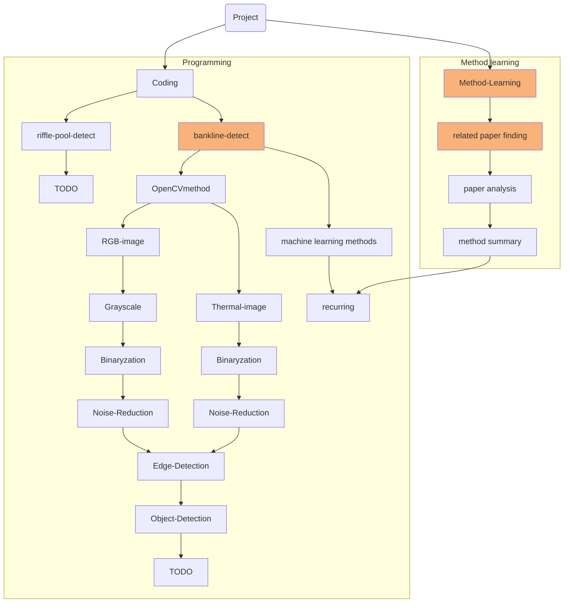

<!--  -->
# Image Processing For Geography

[[_TOC_]]

## Introduction
This project is main about detecting bank line in visible light and thermal camera images

## Team
**Group 1 - Image Processing**
### Members
- Xiaoying YANG  [scyxy3@nottingham.edu.cn](scyxy3@nottingham.edu.cn)
- Junyu LIU [scyjl5@nottingham.edu.cn](scyjl5@nottingham.edu.cn)
- Zhiyu DONG  [scyzd1@nottingham.edu.cn](scyzd1@nottingham.edu.cn)

## Tasks
### Workflow (it is the temporary one)



### Goals & Reports
1. [x] Week1 [Report](./report/weekly-report/week1.md)
    - Xiaoying YANG
        - [x] Read paper
        - [x] Unified configuration environment
        - [x] Decide the framework
    - Junyu LIU
        - [x] Read paper
        - [x] Continue to learn image processing
    - Zhiyu DONG
        - [x] Start to learn image processing
2. [ ] Week2 [Report](./report/weekly-report/week2.md)
     - Xiaoying YANG
        - [x] Read paper
        - [x] Refactor the previous image processing code
  
    - Junyu LIU
        - [x] Read paper
        - [ ] Continue to learn image peocessing and try to implement
    - Zhiyu DONG
        - [x] Read paper
        - [x] Continue to learn image peocessing and try to implement

3. [ ] Week3 and Week4 
     - Xiaoying YANG
        - [x] Refactor the previous image processing code
        - [x] Make the labeling tool
     - Zhiyu DONG
        - [x] Read Paper
        - [x] Continue to learn image processing and try to implement

## Resources
### Paper
1. [Detectability of Objects at the Sea Surface in Visible Light and Thermal Camera Images](./paper/bankline-detection/traditional-method/OCEANS18_dahlin.pdf)
    > The method idea in this paper is similar to our traditional idea. 
    [reading link](./report/paper-analysis/week1_reading.md)

- **`Related Paper`** 
    - [Assessing Deep-learning Methods for Object Detection at Sea from LWIR Images](./paper/bankline-detection/related(plan_to_read)/1-s2.0-S240589631932169X-main.pdf)
        > Original website is [link](https://www.sciencedirect.com/science/article/pii/S240589631932169X)
        > We're not going to use deep learning but we may be can borrow some of these ideas.
    - [Detection of objects on the ocean surface from a UAV with visual and thermal cameras: A machine learning approach](./paper/bankline-detection/related(plan_to_read)/ICUAS2021_Review.pdf)
        > Original website is [link](https://folk.ntnu.no/torarnj/ICUAS2021_Review.pdf)
        > May be can use the machine learning part.
2. [Water detection with segmentation guided dynamic texture recognition](./paper/bankline-detection/machine-learning/robio_2012.pdf)
    > It offers a machine learning method K - means to detect the bankline.
    [readlink](https://ieeexplore.ieee.org/abstract/document/6491235)

- **`Related Paper`** 
    - [Quadcopter-based stagnant water identification](https://ieeexplore.ieee.org/abstract/document/7490049/figures#figures)
    - [An Algorithm for Identification of Inland River Shorelines based on Phase Correlation Algorithm](https://ieeexplore.ieee.org/abstract/document/8996801)

3. [An Algorithm for Identification of Inland River Shorelines based on Phase Correlation Algorithm](./paper/bankline-detection/traditional_method/08996801.pdf)
    > It offers tradition edge detection methods to distinguish the sky line and bank edges and provide Phase Correlation Algorithm to revise the result.
     [readlink](https://ieeexplore.ieee.org/abstract/document/8996801)

     [report](./report/paper-analysis/week3_Zhiyu.md)
     
     **issues** I can't understand the details of Phase Correlation Algorithm as its algebra formula. However, for our research, at the present stage, this algorithm will not make affect with the result whether using or not. 


### Datasets
1. **`DJI photos`**  [onedrive link](https://nottinghamedu1-my.sharepoint.com:443/:f:/g/personal/z2017053_nottingham_edu_cn/EqaO2ktFvYREpmjyNbH-JiEBLdeSCsqdDRIjMKjVke9rFw?e=5%3aTIL3Rb&at=9)


### Code
- [refactoring demo](./code/code.py)
  - [code report](./code/report-for-code/demo.md)

## Guides
### Environment Configuration
 - Use python3 ([basic install](https://mp.weixin.qq.com/s/HaUouvCsEaNgpM2jLURoag))
 - Initialize a new environmental
    ```
    (windows)
    pip install virtualenv
    virtualenv venv
    cd venv/Scripts
    .\activate
    pip install opencv-python
    pip install numpy
    ```
