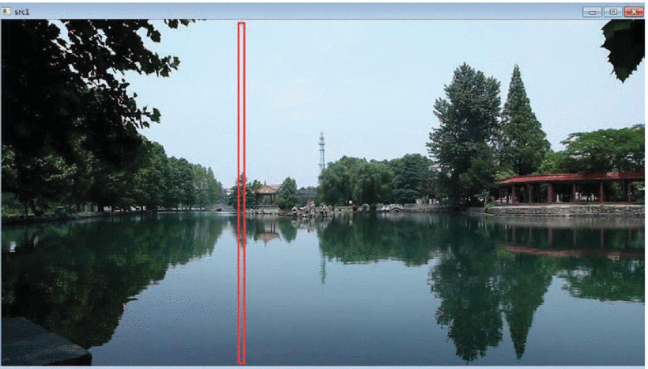
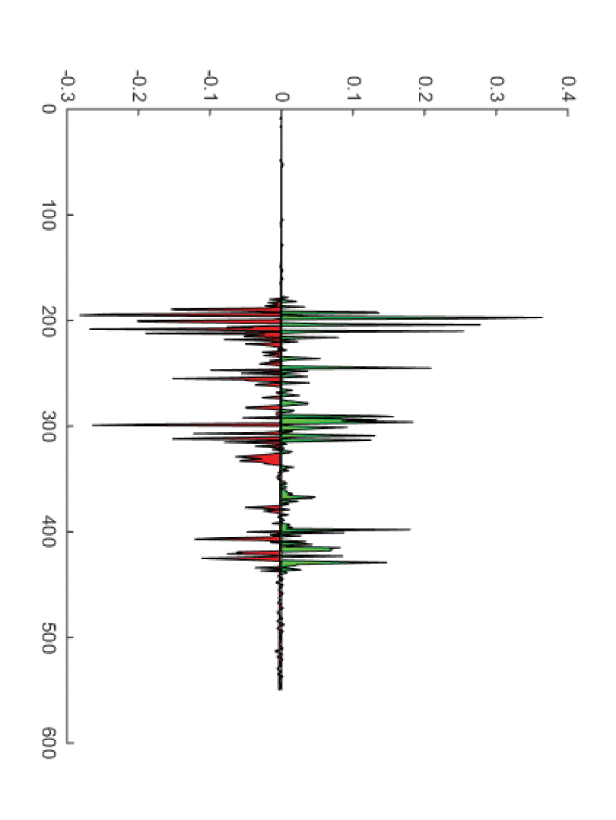
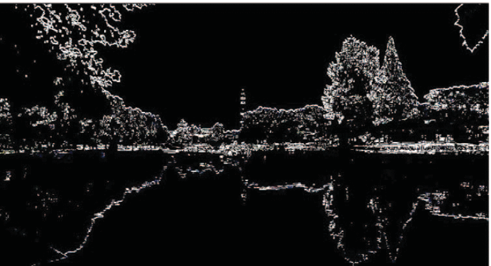
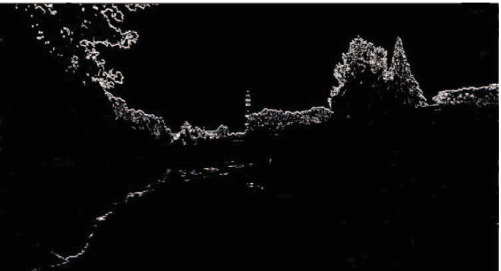
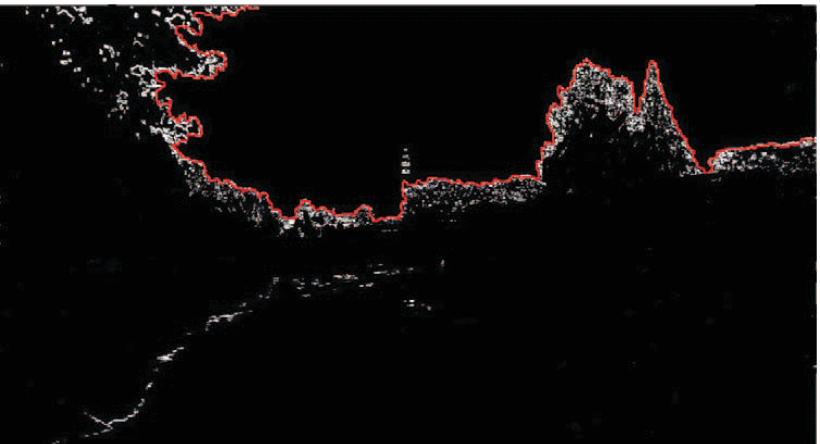

# An Algorithm for Identification of Inland River Shorelines base on Phase Correlation Algorithm 
### 给予相位相关算法的内河河岸线识别算法

## brief

> Accroding to the characteristics of water surface, the extraction of shoreline can be divided into **Marine surface** and **inland surface**. Many researches focus on Marine surface identification, whose image can be easily divided into three main parts: sky, water and land. And the comment algorithm used are based on edge detection, cluster segmentation,  threshold segmentation. For another situation(inland river identifiaction), these method will be affected by reflection from water surface.

> Focus on these negative effects, the reduction of brightness value of the water surface area covered by reflection will make the edge detection and threshold segmentation methods be inapplicable

> And then there are four relative solutions:

    1.   proposed assumptions about river scene structure to learn appearance models based on their features, such as color, texture and image location, which are used to segment images.
    2.   classifing each pixel into four classes: three gaussian component and one explanation outliers. Water, land and sky are contained in three gaussian component and the water obstacles
    3.    An automatic detection method of water area boundary, which combined optical shadow processing technology and energy optimization technology together.

**Phase coorelation algorithm**

1. Advantages: less computation, strong real-time performance and insensitivity to noise

2. Process: 
   1. 利用垂直特征得到天际线的候选点， 通过天际线候选点的水平特征将所有候选点链接起来。
   > 1. 分析垂直列的像素点， 对图像中的像素列进行均匀采样。
   > 2. 对垂直分析的像素点分析水平梯度， 提取出天际线候选点
   > 3. 连接所有候选点得到天际线轮廓

3. Details: 
   A. Local maximum of gradient Intensity analysis 梯度强度分析的局部最大值：
    > 获取灰度图和灰度信息，以所有列为样本，通过图像的强度梯度寻找与天际线相似的区域（在灰度图中，天际线为较明亮区域，水面与陆地为较暗区域）因此垂直线中最大梯度的位置作为天际线的候选特征点。

   B. feature point filtering 特征点提取：

     Example 
    > 原图：
    

    > 从该列得到的每个像素点的梯度值：
    

    > 梯度值超过阈值的像素点：
    

    > 经过算法筛选得候选边界：
    

    > 算法筛选后天际线边界：
    

    > 约束条件下的天际线边缘的有效特征提取的结果：
    

    C. Phase Correlation 相位相关

# 
