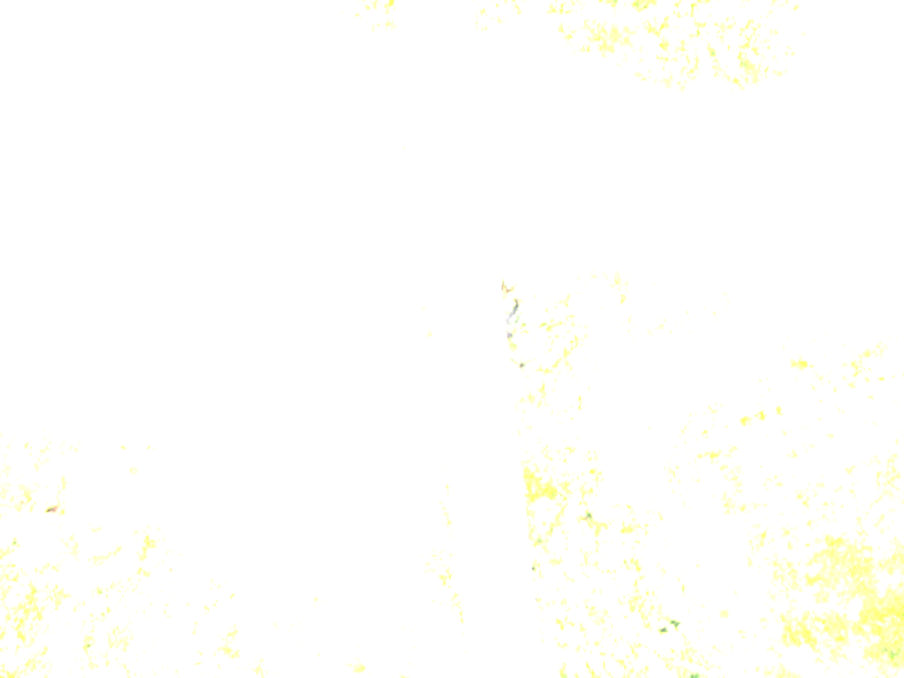
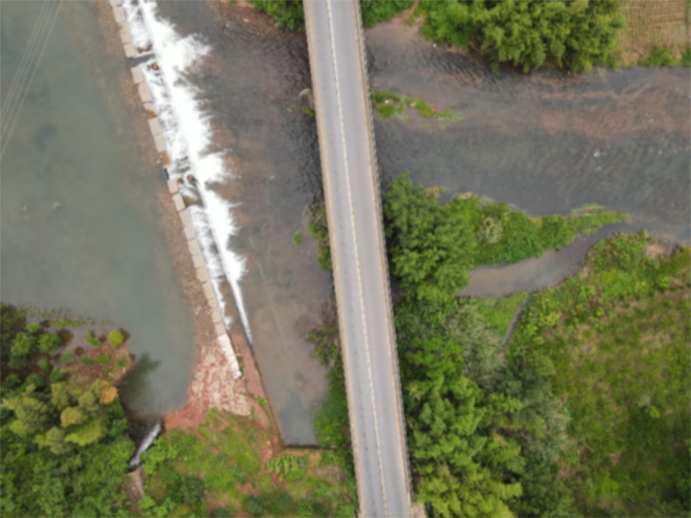

# Convolution Operation
**1.** 数学层面：
<table>
<li>
连续函数:

 $$\int_{-\infty}^{\infty}f(\tau)g(x-\tau)d\tau$$

</li>
</br>
<li>
离散函数：

 $$\sum^{\infty}_{i=-\infty}x(i)h(n-i)$$
</li>
</table>

卷积是两个两个变量在某个范围内相乘后求和的结果，**本质上是对某一个函数进行翻转叠加**，其中叠加是指：求两个函数的乘积求积分（针对连续函数）或对函数进行加权求值（针对离散函数）

**2.** 图像平滑处理：
<li>二维卷积：
<br>
&emsp;&emsp;二维卷积公式:

 $$\sum_{i=0}^k\sum^k_{j=0}g(i,j)h(k-i,k-j)$$

&emsp;&emsp;其中**k的值为卷积核的size**，不同的卷积核对图片进行处理会得到不同结果，但是一般来说卷积核的大小都是 **(3, 3), (5, 5), (7, 7)**,因为奇数大小的卷积核会有一个中心
</table>
</br>

**3.** 图像降噪：

<br>

<font color = "blue">原始图像: </font>

 <ul>
    1. 均值滤波：

 ```
 def noice_reduction:
    img = cv2.imread("opencvlearning\\004.jpg")
    blur_result = cv2.blur(img, (3,3))   #利用均值滤波对图像中的所有像素数值处理
                                  #均值滤波：e.g: [[1,1,1]
                                  #              [1,1,1]
                                  #              [1,1,1]] 
    cvdisplay("source", img)
    cvdisplay("reduction", blur_result)
    return
 ```
 #### 对于核心函数：cv2.blur(src, kernel)
 共有**两个**参数，其中*src*是输入的图片（读取进去的图片），*kernel*是滤波器（卷积核）的大小（3,3）意思是卷积核是一个3*3的**均值矩阵**

 <font color = "blue">均值处理:</font>
 

 <br>
2. 方框滤波：
   
   ```
   box_result = cv2.boxFilter(img, -1, (3,3), normalize = True)
   ```
   #### 核心函数：cv2.boxFilter(img, -1, (3,3), normalize = True)
   该函数中包括**四个参数**，其中第一个参数是src即读取进函数的图片，第二个参数为其**颜色通道取值**且通常情况下**其值都为1**， 第三个参数与上述基本相同为**卷积核**一般为奇数，**最后一个参数表示选择其归一化，当normalize为True的时候该函数使用归一化即将所有box内的RGB值加起来除以9， 这与均值滤波所得到的结果相同；而当normalize为False的时候其结果会将所有box内的值相加得到中心点的RGB值**。

   <font color = "blue">方框处理（normalize = False）:</font>
 

   <br>

   <font color = "blue">方框处理（normalize = True）:</font>
 

<br>
3. 高斯滤波：

   ```
    aussian = cv2.GaussianBlur(img, (5,5), 1) 
   ```
   #### 核心函数： cv2.GaussianBlur（img,(5,5), 1)
   该函数需要3个参数，第一个参数为src即读取进函数的图片，第二个函数为其进行卷积计算的卷积核的大小，同上述各个函数的卷积核相同，其大小为奇数。原理：**根据高斯分布，距离区域内中心像素点越近的像素的RGB数值所占比重应该越大**从而对整个区域不同像素的RGB值进行加权后卷积运算最后得到的值为中心像素的RGB值

<br>

<font color = 'blue'>高斯处理：</font>


<br>
4. 中值滤波：
   
  ```
   median = cv2.medianBlur(img, 5)
  ``` 
  #### 核心函数： cv2.medianBlur(img, 5)
  该函数需要**两个**参数，第一个参数为src即读取进函数的图片，第二个函数为其去中值的范围即卷积核的大小，5即5*5范围。其工作原理为：**用卷积核的范围框定图像中被处理的RGB值的范围，然后将该范围的RGB值由大到小进行排序去中值作为该区域内最中心的像素的RGB值**

  <br>

  <font color = "blue">中值滤波</font>
  

</ul>
<br>
<br>

# 形态学--腐蚀操作

<font color = "red" size = "4pt"> 注意事项：腐蚀操作针对的对象一般是二值图片（灰度图）</font>

<br>

```
    kernel = np.ones((5,5), np.uint8)
    erosion = cv2.erode(img, kernel, iterations = 1)
```
#### 核心函数：cv2.erode(img, kernel, iterations)
其中img是读入函数的图片（**灰度图，二值图像**），kernel是该函数处理图片所用到的**卷积核**，iteration是该函数（对图片进行腐蚀操作）迭代的次数

腐蚀操作的意义：腐蚀操作针对**二值图像**用于处理二值图像中的毛刺，将图片中的主体向主体内部缩减

# 形态学--膨胀操作

<br>
```
    kernel = np.ones((3,3), np.uint8)
    dige_dilate = cv2.dilate(img, kernel, iterations = 1)
```

#### 核心函数：cv2.dilate(img, kernel, iterations)
同上面腐蚀操作相同，其中img是读入函数的图片（**灰度图，二值图像**），kernel是该函数处理图片所用到的**卷积核**，iteration是该函数（对图片进行腐蚀操作）迭代的次数

**其中kernel卷积核的尺寸决定对图片处理的结果，当卷积核越大

膨胀操作的意义：膨胀操作是腐蚀操作的逆操作，经过腐蚀操作对图像的边缘毛刺的同时会对图像的主体也有一定的腐蚀，此时通过膨胀处理解决图片边缘被腐蚀的问题
