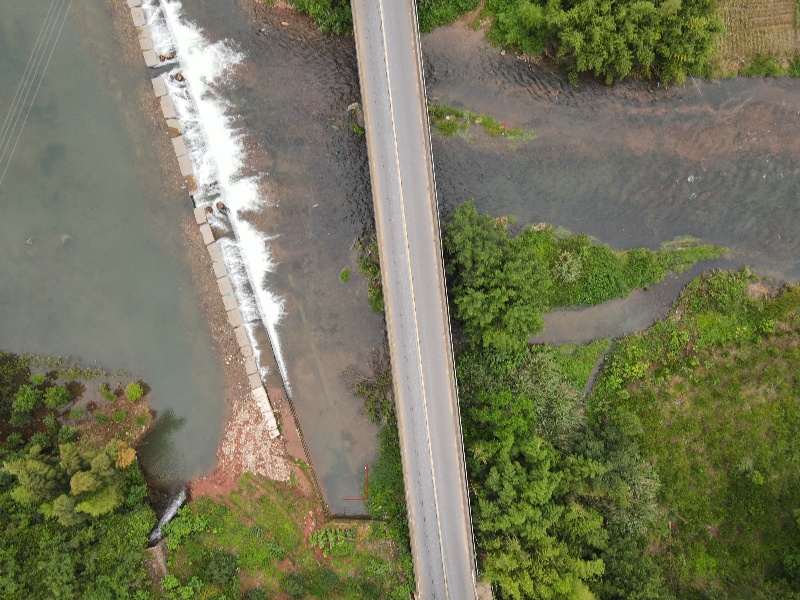

# Convolution Operation
**1.** 数学层面：
<table>
<li>
连续函数:

$$\int_{-\infty}^{\infty}f(\tau)g(x-\tau)d\tau$$

</li>
</br>
<li>
离散函数：

$$\sum^{\infty}_{i=-\infty}x(i)h(n-i)$$
</li>
</table>

卷积是两个两个变量在某个范围内相乘后求和的结果，**本质上是对某一个函数进行翻转叠加**，其中叠加是指：求两个函数的乘积求积分（针对连续函数）或对函数进行加权求值（针对离散函数）

**2.** 图像平滑处理：
<li>二维卷积：
<br>
&emsp;&emsp;二维卷积公式:

$$\sum_{i=0}^k\sum^k_{j=0}g(i,j)h(k-i,k-j)$$

&emsp;&emsp;其中**k的值为卷积核的size**，不同的卷积核对图片进行处理会得到不同结果，但是一般来说卷积核的大小都是 **(3, 3), (5, 5), (7, 7)**,因为奇数大小的卷积核会有一个中心
</table>
</br>

**3.** 图像降噪：

<br>

<font color = "blue">原始图像: </font>

 <ul>
    1. 均值滤波：

 ```
 def noice_reduction:
    img = cv2.imread("opencvlearning\\004.jpg")
    blur_result = cv2.blur(img, (3,3))   #利用均值滤波对图像中的所有像素数值处理
                                  #均值滤波：e.g: [[1,1,1]
                                  #              [1,1,1]
                                  #              [1,1,1]] 
    cvdisplay("source", img)
    cvdisplay("reduction", blur_result)
    return
 ```
 #### 对于核心函数：cv2.blur(src, kernel)
 共有**两个**参数，其中*src*是输入的图片（读取进去的图片），*kernel*是滤波器（卷积核）的大小（3,3）意思是卷积核是一个3*3的**均值矩阵**

 <font color = "blue">均值处理:</font>
 

 <br>
2. 方框滤波：
   
   ```
   box_result = cv2.boxFilter(img, -1, (3,3), normalize = True)
   ```
   #### 核心函数：cv2.boxFilter(img, -1, (3,3), normalize = True)
   该函数中包括**四个参数**，其中第一个参数是src即读取进函数的图片，第二个参数为其**颜色通道取值**且通常情况下**其值都为1**， 第三个参数与上述基本相同为**卷积核**一般为奇数，**最后一个参数表示选择其归一化，当normalize为True的时候该函数使用归一化即将所有box内的RGB值加起来除以9， 这与均值滤波所得到的结果相同；而当normalize为False的时候其结果会将所有box内的值相加得到中心点的RGB值**。

   <font color = "blue">方框处理（normalize = False）:</font>
 

   <br>

   <font color = "blue">方框处理（normalize = True）:</font>
 

<br>
3. 高斯滤波：

   ```
    aussian = cv2.GaussianBlur(img, (5,5), 1) 
   ```
   #### 核心函数： cv2.GaussianBlur（img,(5,5), 1)
   该函数需要3个参数，第一个参数为src即读取进函数的图片，第二个函数为其进行卷积计算的卷积核的大小，同上述各个函数的卷积核相同，其大小为奇数。原理：**根据高斯分布，距离区域内中心像素点越近的像素的RGB数值所占比重应该越大**从而对整个区域不同像素的RGB值进行加权后卷积运算最后得到的值为中心像素的RGB值

<br>

<font color = 'blue'>高斯处理：</font>


<br>
4. 中值滤波：
   
  ```
   median = cv2.medianBlur(img, 5)
  ``` 
  #### 核心函数： cv2.medianBlur(img, 5)
  该函数需要**两个**参数，第一个参数为src即读取进函数的图片，第二个函数为其去中值的范围即卷积核的大小，5即5*5范围。其工作原理为：**用卷积核的范围框定图像中被处理的RGB值的范围，然后将该范围的RGB值由大到小进行排序去中值作为该区域内最中心的像素的RGB值**

  <br>

  <font color = "blue">中值滤波</font>
  

</ul>
<br>
<br>

# 形态学--腐蚀操作

<font color = "red" size = "4pt"> 注意事项：腐蚀操作针对的对象一般是二值图片（灰度图）</font>

<br>

```
    kernel = np.ones((5,5), np.uint8)
    erosion = cv2.erode(img, kernel, iterations = 1)
```
#### 核心函数：cv2.erode(img, kernel, iterations)
其中img是读入函数的图片（**灰度图，二值图像**），kernel是该函数处理图片所用到的**卷积核**，iteration是该函数（对图片进行腐蚀操作）迭代的次数

腐蚀操作的意义：腐蚀操作针对**二值图像**用于处理二值图像中的毛刺，将图片中的主体向主体内部缩减

# 形态学--膨胀操作

<br>
```
    kernel = np.ones((3,3), np.uint8)
    dige_dilate = cv2.dilate(img, kernel, iterations = 1)
```

#### 核心函数：cv2.dilate(img, kernel, iterations)
同上面腐蚀操作相同，其中img是读入函数的图片（**灰度图，二值图像**），kernel是该函数处理图片所用到的**卷积核**，iteration是该函数（对图片进行腐蚀操作）迭代的次数

**其中kernel卷积核的尺寸决定对图片处理的结果，当卷积核越大

膨胀操作的意义：膨胀操作是腐蚀操作的逆操作，经过腐蚀操作对图像的边缘毛刺的同时会对图像的主体也有一定的腐蚀，此时通过膨胀处理解决图片边缘被腐蚀的问题
<br>
<br>


# 计算图像的梯度

1. 图像的梯度：对于图像的主题，首先图像中的主体不止一个，所以在主体与主体之间会存在明显的分界线，而分界线的两边会存在一个颜色差，颜色差反应到图片的底层就可以理解为RGB图像的矩阵的数据，数值差，这个数值差就作为梯度在图片中存在。通过该梯度可以寻找主题的边界，从而达到边缘检测的目的。
    
2. sobel算子：
   - 工作原理：<br>
      sobel算子本质上是一个矩阵，这个矩阵也将作为sobel算子工作过程中用于计算的卷积核，同样的，其大小基本为（3，3） 或 （5，5）<br>

      <font color = "red" >Example：</font>
      $$
      \left\{
      \begin{matrix}
      1 & 0 & -1 \\
      2 & 0 & -2 \\
      1 & 0 & -1 \\
      \end{matrix}
      \right\}
      \tag{1}
         $$
      
      利用该卷积核针对图像中，以某一像素点为中心的九个像素点的数值进行计算<br>

      <font color = "red"> For example:</font>

      $$
      \left\{
      \begin{matrix}
      A & B & C \\
      D & E & F \\
      G & H & I \\
      \end{matrix}
      \right\}
      \tag{2}
         $$

      使用（1）的sobel算子对（2）中的数值进行计算：<br>
      <font color = red> result = A - C + 2D - 2F + G - I </font>

      <br>

# Canny边缘检测算法 
   <br>

 - 使用滤波器, 对图像进行降噪，平滑处理
  
 - 计算图像中每个像素点的梯度强度与方向
 - 应用非极大值抑制，以消除边缘检测带来的杂散影响
 - 应用双阈值检测来确定真实的和潜在的边界（在进行边缘检测后会存在很多边界候选值，通过双阈值检测过滤筛选其边界）
 - 通过抑制孤立的弱边缘最终完成检测

<br>

**非极大值抑制方法：**
1. 线性插值法：
   
   1). 主要方法：M(dtmp1) = w*M(g2) + (1-w)*M(g1)

   2). 原理：dtmp1是要求的亚像素（非某一特定像素点）上的梯度幅值，g1和g2是与该亚像素点相邻的最近的两个像素点，通过距离加权g1和g2的梯度幅值计算该亚像素点的梯度幅值

2. 为了简化计算，通过一个像素点周围的8个像素，把一个像素的梯度方向离散为八个方向，这样只需计算前后即可，不用插值。
   
**双阈值检测：**
1. maxValue: 当某个像素的梯度值 > maxValue， 则将这个像素处理为一个边界
2. minValue：当某个像素的梯度值 < minValue， 则舍弃该像素点（判定该像素点非边界）
3. 当某个像素点的梯度值在minValue和maxValue之间，如果该像素与边界相连则判定该像素为边界，otherwise直接舍弃判定为非边界

   数值改变：
   - 减小minValue（maxValue）值：图片中会划分出更多的边界，将更多的候选值加入到边界划分范围内
   - 增大minValue（maxValue）值：只有极大可能确定为边界的东西会被取，其他值均被舍弃


# 图像金字塔
   **1. 高斯金字塔**<br>
   - 方法一： 向下采样法（缩小）pyrDown
      > 将图片与高斯内核进行卷积操作（卷积核遵从高斯分布）
      > 将所有的偶数行与偶数列全部去除

   - 方法二： 向上采样法（放大）pyrUp
      > 将图片中每一个像素扩充为原来的两倍大小，新增的行和列以0填充。
      > 使用与"向下采样法"相同的卷积核（高斯卷积核）与放大的图像进行卷积操作。

   <br>

   **2. 拉普拉斯金字塔** <br>

   先进行pyrDown操作，后进行pyrUp操作，然后用原图src减进行操作之后的图像得到卷积核对整个图像处理的部分


   **3. 图像金字塔和resize的区别**

   cv2.resize 函数对图像的操作是任意比例改变图像的比例
   cv2.pyrUp和cv2.pyrDown是对图像利用高斯卷积核等比例放大缩小


   <br>

# 图像轮廓

1. 主要函数： cv2.findContours(img, mode, method)
   - img: 输入进函数的源图像

   - mode：检测轮廓时用的轮廓检测模式
   - method： 轮廓检测的方法

2. 轮廓检测模式：

   - RETR_EXTERNAL: 只检测图像最边缘的轮廓

   - RETR_LIST: 检测出来的轮廓保存到链表中
   - RETR_CCOMP: 检测所有轮廓， 并将所有轮廓组织成两层：顶层是各个部分的外部边界，第二层是空洞边界
   - RETR_TREE: 检测所有轮廓，并冲够用嵌套轮廓的整个层次
  
3. 轮廓检测方法
   - CHAIN_APPROX_NONE: 以Freeman链码的方式输出轮廓，所有其他方法输出多边形--保留所有的边框
  
   - CHAIN_APPROX_SIMPLE: 压缩水平的，垂直的，和斜的部分，函数只保留其终点部分 -- 压缩之后得到的边界点，最后只保留边缘的终点部分

   ## 解决轮廓检测的方法：

   ```
   def contour():
      img = cv2.imread("opencvlearning\DJI_0215.JPG") #读入图片
      gray = cv2.cvtColor(img, cv2.COLOR_RGB2GRAY) #转化成二值图像
      ret, thresh  = cv2.threshold(gray, 50, 255, cv2.THRESH_BINARY)
      contours, hierarchy = cv2.findContours(thresh, cv2.RETR_TREE, cv2.CHAIN_APPROX_SIMPLE)
      #binary中保存的是图像的灰度图（二值图）， contour保存的是轮廓点， hierarchy中保存的是图像的层级
      source = cv2.imread("opencvlearning\DJI_0214.JPG")
      img_draw = source.copy()
      img_draw = cv2.resize(img_draw, (0,0), fx = (512/6000), fy = (640/8000))
      print(hierarchy)
      res = cv2.drawContours(img_draw, contours, -1, (0, 255, 0), 1)
      cvdisplay("contours", res)
   ```

   

   **操作过程**
   1. 先对红外图像进行二值操作，将RGB图像转化成二值图像
   
   2. 对得到的二值图像进行轮廓提取
   3. 将红外二值图中提取出来的轮廓与RGB图像结合输出
   
   **结果存在的问题**
   1. 两个图像大小比例不同，从红外图像中提取出来的轮廓大小比例无法与RGB图像重合
   
   2. 现在对于图像轮廓的处理只通过红外图像提取，提取结果只针对红外图像中颜色较深的部分，而不是对于水域部分的轮廓提取

## 模板匹配：

```
#模板匹配
def pipei():             #膜版匹配目前还有问题
    src1 = cv2.imread("opencvlearning//DJI_0214.JPG")
    src = src1.copy()
    template = cv2.imread("opencvlearning//0214_template.png")
    res = cv2.matchTemplate(src, template, cv2.TM_SQDIFF)
    min_val, max_val, min_loc, max_loc = cv2.minMaxLoc(res)
    print(min_val, min_loc, max_val, max_loc)
    w,h,t = template.shape
    bottom_right = min_loc[0] + w, min_loc[1] + h
    cv2.rectangle(src, min_loc, bottom_right, (0,0,255), 2)
    src = cv2.resize(src, (0,0), fx = 0.1, fy = 0.1)
    cvdisplay("res", src)
    res = cv2.resize(res, (0,0), fx = 0.1, fy = 0.1)
    cvdisplay("result", res)
```


目前效果：


 
