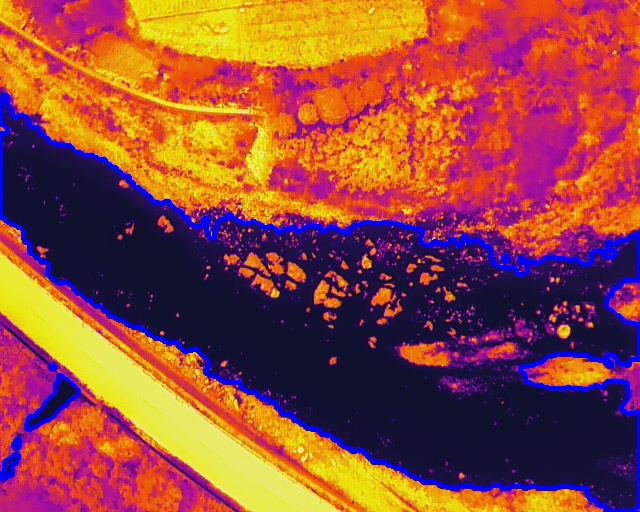
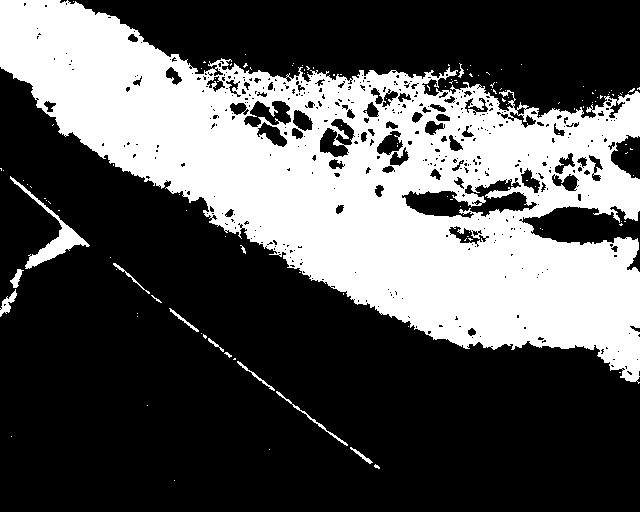
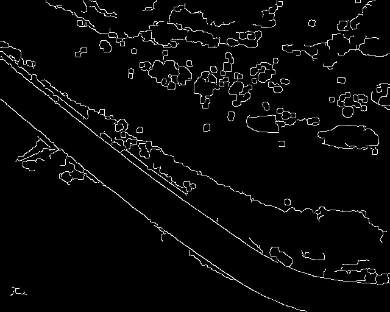
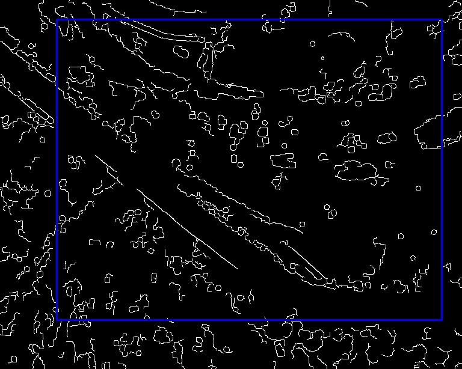
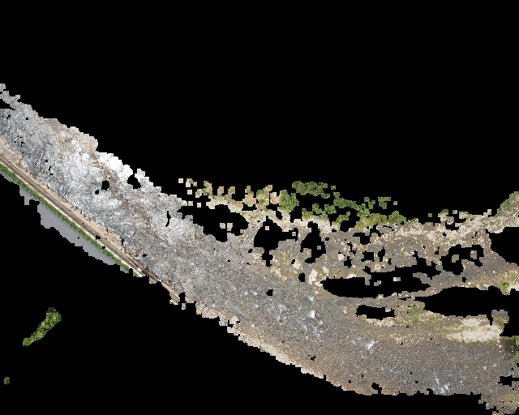
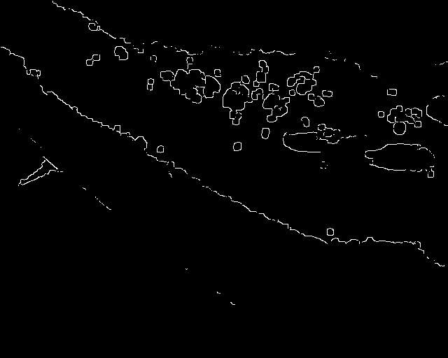
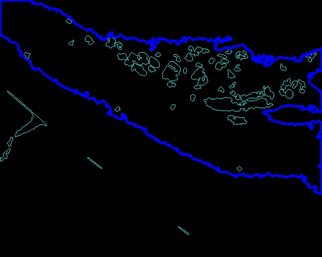
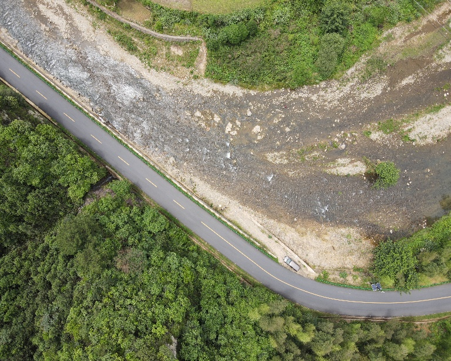
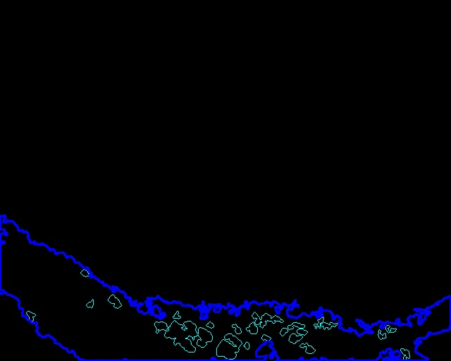
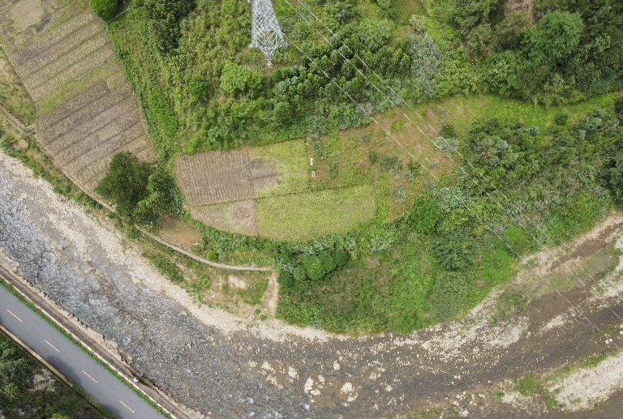

# method for the image processing 

## water area detection

1. classify the different area of the water image using the thermal camera images
   - set the different color threshold value to detect the area in thermal camera images(the threshold need change in different dataset)
    

   - process the image to reduct noise, get the area as a mask
    

   - detect the edge of the RGB image
      1. It is a multi-stage algorithm and we will go through each stages.
      2. Noise Reduction
      3. Since edge detection is susceptible to noise in the image, first step is to remove the noise in the image with a 5x5 Gaussian filter. 
      4. Non-maximum Suppression
      5. Hysteresis Thresholding
    - find the counters of the edge
      - cv.CHAIN_APPROX_NONE, all the boundary points are stored. But actually do we need all the points? For eg, you found the contour of a straight line. Do you need all the points on the line to represent that line? No, we need just two end points of that line. It removes all redundant points and compresses the contour, thereby saving memory.
   

    
    
    - use all the edges in the pair of the images to properly match them
       - It simply slides the template image over the input image (as in 2D convolution) and compares the template and patch of input image under the template image. Several comparison methods are implemented in OpenCV. (You can check docs for more details). It returns a grayscale image, where each pixel denotes how much does the neighbourhood of that pixel match with template.

    - use the mask created by the thermal iamge on RGB image 

2. riffle - pool detection
   - Consider the small area of the counters as the stone
   - detect the stones in RGB image

 

   - detect the stone in combined image

 

